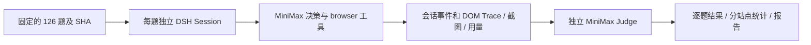

# WebVoyager 126 题评测

我们的评测链路使用真实 Cordis + DSH AgentLoop + 本仓库编译的 dsh-browser 插件。每题创建独立 Session 和 Chromium；Agent 决定工具调用，独立 LLM 请求严格按固定上游 `judge-prompt.md` 比较任务与最终答案，输出 Trace、截图、成功率、步数、耗时及成本估算。

## 完整评测结果

WebVoyager 126 tasks / 3 站点：成功率 88.9%（AllRecipes 86.7%、Apple 90.5%、Amazon 89.7%），平均 27.1 步、176.3s。

| 站点 | 题数 | 通过 | 成功率 |
| --- | ---: | ---: | ---: |
| AllRecipes | 45 | 39 | 86.7% |
| Apple | 42 | 38 | 90.5% |
| Amazon | 39 | 35 | 89.7% |
| **合计** | **126** | **112** | **88.9%** |

我们用 `MiniMax-M3` High、`--concurrency 1`、`--headed --timeout 600000 --judge reference` 运行并重新评分。原 109 题轨迹被保护不重跑，随后按 126 题数据集原序补齐 17 题，因此这是混合时间批次，而不是一次全新受控的 126 题运行。重评分前已删除旧 evidence Judge 的结果、日志、费用、耗时和汇总；最终 126 题全部由 LLM-as-a-Judge 依照 `judge-prompt.md` 判定，包括 11 个 `step_limit` 结果。`missing=0`、`unjudged=0`，每题均保留 `session.json` 和非空 `trace.ndjson`。

当前 126 条结果的 Agent 成本估算为 $12.126323，Judge 为 $0.243535，合计 $12.369858；126 题用量均有记录。另有 4 个被替换的历史 Agent attempt，其已观测成本 $0.360453 单独保留，不计入当前结果总额。这些仍是配置单价下的 USD 等价估算，不是 Token Plan 实际账单。可读报告位于 `output/evals/webvoyager-109-20260916-concurrency1/report.md`；目录名保留历史名称，实际任务数以 manifest 的 126 题为准。

## 参考结果核查

参考分支固定到 [856867996e73f7dcc5e39827bf2af7555bd63d40](https://github.com/oktton/opencode-browser/tree/856867996e73f7dcc5e39827bf2af7555bd63d40/assets/benchmark)。从 `results/merged/results.ndjson` 取得实际跑过的 task_id，再匹配该版本 `WebVoyager_data.json` 中的原始任务，不以“每站取前 N 条”代替。

| 站点 | 题数 | 原项目通过数 | 原项目成功率 |
| --- | ---: | ---: | ---: |
| Allrecipes | 35 | 28 | 80.0% |
| Apple | 35 | 26 | 74.3% |
| Amazon | 39 | 26 | 66.7% |
| 总计 | 109 | 80 | 73.4% |

重算原始记录：平均 9.1927 次工具调用、149.971 秒、$0.024457/题；执行完成 91 题，Judge 通过 80 题。上游数据文件有 549 条任务，历史对照仅使用实际评测的 109 条。选题 ID、上游 SHA、源文件 SHA-256、统计摘要见 `assets/benchmark/reference.json`；当前三个站点的完整 126 题保存在 `webvoyager-126.json`。来源许可保留于同目录 `LICENSE.txt`。

这些数字是原项目的结果，不能当作 dsh-browser 的结果。原轨迹含 webfetch、bash、read、grep；本链路只挂载 browser 工具，也保留本仓库任务证据和完成校验，因此工具数、提示词、上下文管理和执行日期不同。原始记录中的 Agent 为 minimax-cn/MiniMax-M3（部分错误记录模型字段为空），公开 judgments 未注明 Judge 模型。

## 启动

在源码仓库运行，要求 Node >= 22.19 和本机 Chrome/Chromium：

```powershell
npm install
npm run build
npm run eval:test
npm run eval:smoke
npm run eval -- --dry-run --reasoning-effort high --headed --timeout 600000 --judge reference
npm run eval -- --out output/evals/pilot --ids Allrecipes--0,Apple--0,Amazon--0 --reasoning-effort high --concurrency 1 --headed --timeout 600000 --judge reference
npm run eval -- --out output/evals/webvoyager-126 --reasoning-effort high --concurrency 1 --headed --timeout 600000 --judge reference
```

`eval:smoke` 使用真实浏览器和 DSH AgentLoop，但模型与 Judge 是确定性测试替身，不调用收费 API，不计入 benchmark。普通 `eval` 使用 DSH 当前配置中的真实模型。

正式评测条件固定为 `--headed --timeout 600000 --judge reference`，这三项同时也是 CLI 默认值：使用可见浏览器窗口、每题最多运行 600 秒，并按固定上游版本 `856867996e73f7dcc5e39827bf2af7555bd63d40` 的 `judge-prompt.md` 规则评分。正式命令仍显式写出这些参数，方便复核和复现。

启动时先做一次小请求检查服务可用性，默认等待 60000 ms，可用 `--preflight-timeout` 调整；结果单独记录到 `preflight.ndjson`，不计入逐题成绩。Agent 运行中的临时 HTTP 429、5xx、超时和传输错误会在同一模型步骤内最多重试 5 次，采用 500 ms–10 s 指数退避和抖动，并优先遵守有效的 `Retry-After`；重试事件写入 Session Trace。额度耗尽和认证失败不在本次运行中重试。服务故障停止派发新题，已在运行的题目按原时限结束，未派发题保持 missing/unjudged。服务恢复后 `--resume` 重试服务中断题，不再将已有错误记录视为完成；正常任务失败不自动重试。这里管理的是评测模型 provider 额度，与桌面应用或代码工具的账户限额无关；程序不购买额度，也不承诺在未知刷新时间自动唤醒。

MiniMax 五小时额度耗尽时，失败任务进入 `recovery.json` 待重测清单，`summary.json.quota_retry_task_ids` 同步列出任务 ID，不将其当作有效的任务失败评分。即使接口只返回 `2056` 错误码、HTTP 200 中的额度错误，或外层超时覆盖了错误文字，仍保留重测依据。恢复运行会先检查接口是否可用：额度仍不足时不创建新任务尝试，待测清单保持不变；可用后优先从头重测额度中断任务，再继续未运行任务。此前已经正常完成的任务跳过。

如果 Agent 已完成、只有 Judge 评分遇到额度限制，恢复时只补评分，见 `quota_rejudge_task_ids`。任务原始尝试、Trace 和已发生费用保留，新尝试写到 `attempts/2/` 等目录，表格展示该题最新尝试。父进程未登记但子进程已落盘的额度失败，也会在同一次恢复中登记并重新派发。

额度恢复后，用原来的选题、模型和运行参数加 `--resume`；可先加 `--dry-run` 查看重测顺序（不调用模型）：

```powershell
npm run eval -- --out output/evals/webvoyager-126 --reasoning-effort high --concurrency 1 --headed --timeout 600000 --judge reference --resume --dry-run
npm run eval -- --out output/evals/webvoyager-126 --reasoning-effort high --concurrency 1 --headed --timeout 600000 --judge reference --resume
```

程序保存恢复状态后退出，不自行固定睡眠五小时；具体刷新时刻以提供方为准。代码更新后的旧运行请使用下文的 `--retry-from` 新目录恢复，仍会重测额度失败项并保留其他结果。

自动读取 `$DSH_HOME/settings.yaml`（默认 `~/.dsh`）中的 `agent-default-model`、`reasoningEffort` 和 `llm-pi-ai.providers`，通过该 provider 的 `apiKeyEnv` 从环境或 `.credentials.yaml` 的 `refs` 获取密钥。不会修改 DSH 配置，也不把密钥复制进仓库。默认 Agent 和 Judge 共用模型、协议、推理档位及凭据，Judge 为独立、无工具、无 Agent 历史的请求。可用环境变量单独覆盖：

| 变量 | 含义 |
| --- | --- |
| `EVAL_PROVIDER` / `EVAL_MODEL` | Agent 路由名 / 模型名 |
| `EVAL_API_PROTOCOL` / `EVAL_BASE_URL` | `anthropic-messages`、`openai-completions` 或 `openai-responses` / 对应兼容地址 |
| `EVAL_API_KEY` / `EVAL_API_KEY_ENV` | 临时密钥 / 已有环境变量或 DSH ref 名 |
| `EVAL_REASONING_EFFORT` | Agent 推理档位；命令行 `--reasoning-effort` 优先 |
| `EVAL_JUDGE_MODEL` / `EVAL_JUDGE_REASONING_EFFORT` | Judge 模型名 / 独立推理档位 |
| `EVAL_JUDGE_API_PROTOCOL` / `EVAL_JUDGE_BASE_URL` / `EVAL_JUDGE_API_KEY` | 独立 Judge 的协议、接口和密钥 |

评测器现在复现当前 DSH 的 MiniMax-M3 High 路径：`minimax-cn` 默认使用 `https://api.minimaxi.com/anthropic/v1/messages`；`high` 映射为 `thinking: { type: "enabled", budget_tokens: 16384 }`，并在 `max_tokens` 中为答案和思考共同预留空间。协议保留 thinking 签名及完整 content 块，以支持工具调用后的 interleaved-thinking 回放。模型、API 协议、推理档位、接口、采样参数、超时和代码指纹都会保存到 manifest，凭据被剔除。显式 `EVAL_BASE_URL` 以 `/v1` 结尾时按 OpenAI-compatible 推断，也可用 `EVAL_API_PROTOCOL` 固定协议；只改模型名称不会令不兼容协议自动可用。

## 评分与统计



- `--judge reference`（默认）：逐字加载固定上游版本的 `judge-prompt.md`，其 SHA-256 为 `bcdf403484823037eaeb6cec7918b966fe90ee31a30bc8d69094d2ff42747ccf`。每次调用提供一条对应的 `WebVoyager_data.json` 任务和一条兼容上游 `run.ts` 字段的 `results.ndjson` 结果，严格要求返回单项 JSON 数组。error/timeout 也必须交给 LLM；只要最终答案有效就允许 PASS。该模式不提交 `session.json`、浏览器文本证据或截图。
- `--judge evidence`：保留本项目原有的严格证据评分，供历史运行兼容。它提交带序号/URL/采集时间的浏览器观测；通过结论必须引用至少一条非错误浏览器观测。JSON 或引用不合法最多修复一次，API/解析错误保持未评分。该模式不与上游 `judge.ts` 等价。
- `--judge none`：仅运行，稍后评分。
- 两种模式遇到 Judge API、截断或输出格式错误时都记录 `pass: null` 和 `judge_error`，避免把“没有得到合法评分”伪装成任务失败；可用 `--judge-only` 补评。

参考项目的 `judge-prompt.md` 允许报错但有有效答案的任务通过，与 `judge.ts` 有差异。当前 `reference` 模式明确以用户指定的 `judge-prompt.md` 为唯一评分真值，不再沿用 `judge.ts` 的非 completed 直接失败规则。

[官方 WebVoyager evaluator](https://github.com/MinorJerry/WebVoyager/blob/main/evaluation/auto_eval.py) 使用截图和回答进行多模态评判；`reference` 模式复现的是 opencode-browser `judge-prompt.md` 的答案合理性规则，不是官方评分程序。最终截图作为人工核验附件保存，不发送给 reference Judge。同模型 Judge 可能产生共同偏差，建议人工抽查部分 PASS/FAIL，并在需要更强独立性时指定另一 Judge。

成功率分母始终为 manifest 中选定的全部任务，包括运行错误、超时和缺失结果。未评分时显示保守的 provisional rate，同时输出 missing/unjudged 和 `scoring_complete: false`。`completed` 仅代表 Agent 执行结束，`judge_result.pass` 才是任务通过。

`steps` 是所有工具调用数（含失败及证据管理工具）；`model_rounds` 是模型请求轮次，两者不能互换。平均步数和平均时间覆盖各题当前尝试（含失败/超时），时间从 worker 初始化到 Agent 停止，不含 Judge 和浏览器清理。默认使用可见浏览器窗口，每题 600000 ms，最多 50 轮模型请求，并采用 `reference` 评分；一次启动每题最多派发一次，服务中断可在恢复时补跑。`--reasoning-effort high` 会进入请求头和运行指纹。并发默认 1，可设 1–8；对照报告应保持一致。

usage.input 是扣除 cache_read/cache_write 的未缓存输入；output 已包含 reasoning，禁止重复计费。Agent 和 Judge 费用分别汇总；缺 usage 或不认识的模型价格显示 null，不能当作 0。MiniMax-M3 使用 [2026-09-13 官方 standard USD 公开单价](https://platform.minimax.io/docs/guides/pricing-paygo)：<=512k 输入 $0.30/M、输出 $1.20/M、缓存读 $0.06/M，超过阈值乘 2。这是标价等价估算，**不是 Token Plan 的实际账单**，也不代表原项目当时的价格。

`cost_observed`/`observed_cost_usd` 是已返回用量的费用小计，`unpriced_calls` 单独记录无法定价的请求；费用小计是下界，不能代替完整费用。`infrastructure_errors`、`halted` 与 `complete_without_infrastructure_errors` 用于判断运行是否受服务故障影响。若曾手动恢复中断记录且终止时间未知，`duration_lower_bound_tasks` 标明下界耗时数量，不将其当作精确耗时。

## 输出与恢复

每个任务的 Agent 一结束（包括错误和超时），立即落盘并更新 `task-metrics.md` 和 `task-metrics.csv`，不必等待整批或 Judge 完成。Judge 结束后再次更新详细统计。表格按选题顺序排列，每题一行，末尾为合计；CSV 带 UTF-8 BOM，可用 Excel 打开：

| 任务 | 完成时间¹ | 工具步骤 | 模型轮次 | 未缓存输入 | 缓存命中 | 缓存写入 | 输出 | 命中率 | 总成本² |
| --- | ---: | ---: | ---: | ---: | ---: | ---: | ---: | ---: | ---: |
| TASK_ID | 秒 | 工具调用数 | API 请求次数 | token | token | token | token | 百分比 | USD |
| **合计** | **耗时相加** | **相加** | **相加** | **相加** | **相加** | **相加** | **相加** | **按 token 加权** | **相加** |

¹ 表中的完成时间是 Agent 耗时，保留三位小数；不含 Judge、截图、清理。并发时合计不是整批墙钟耗时。`started_at` / `finished_at` 为 UTC ISO 开始和结束时间，`evaluation_finished_at` 为本轮评分流程结束时间。强制终止 worker 时使用父进程观察区间，并记录不同的 `duration_basis`。

² 为匹配逐题执行用量，主表成本仅含当前 Agent 尝试，保留八位小数。`task-metrics.json` 另有 `agent_cost_usd`、`judge_cost_usd`、`total_cost_usd`（Agent + Judge），`summary.json.total_task_cost_usd` 汇总两者。`--judge none` 的 Judge 费用为 0；待评分或计费信息不足则为 null。重新运行尝试、历史评分以及 preflight 费用不混入主表，仍保留在原记录与历史费用统计中。

缓存字段单位均为 token：`input_tokens = input + cache_read + cache_write`，`cache_hit_tokens = cache_read`，`cache_miss_tokens = input + cache_write`。命中率按缓存读取除以总输入计算，合计使用总 token 比例而非各题百分比均值。缓存写入是输入缓存创建，不是输出缓存；`output_cache_tokens` 仅在接口显式返回该数据时记录，否则为 null。`output` 已包含 reasoning，不重复收费。

`model_rounds` / `request_count` 是请求次数（含失败和重试）；`model_steps` 是 DSH 逻辑模型步骤，`retry_count` 单列重试次数。`steps` 包括所有工具调用，另有 `failed_steps` / `incomplete_steps`。`model_calls` 保存逐次请求时间、用量、费用，Judge 也使用同样的统计结构。

任何一次请求未返回 usage，则完整 `tokens` 和主表相关列为未知；已返回部分保存在 `tokens_observed` / `usage_observed`，并记录 `usage_missing_calls`。未知价格使完整费用为 null，已知费用小计仍保留。旧记录缺失的新字段不会被编造为 0。主表只列已结束任务，`task-metrics.json` 还列出 missing 项。

除已有 MiniMax 历史价格外，可为任意模型显式配置 **USD / 百万 token** 单价（下面仅为格式示例，不代表任何模型价格）：

```powershell
$env:EVAL_PRICING_JSON = '{"input":2,"output":8,"cache_read":0.5,"cache_write":3}'
# Judge 使用不同模型/地址时需独立配置；相同模型和地址默认继承 Agent 单价
$env:EVAL_JUDGE_PRICING_JSON = '{"input":2,"output":8,"cache_read":0.5,"cache_write":3}'
npm run eval -- --out output/evals/measured-run --count 3 --headed --timeout 600000 --judge reference
```

`input` / `output` 必填，缓存单价可省略，但存在相应非零用量时费用将未知。可同时设置 `context_threshold` 和 `long_context_multiplier` 表示长上下文整次请求的倍率，并用 `source` / `date` 标注价格依据。价格随配置进入 manifest 指纹，汇总中保留定价快照；不会自动推断套餐实际账单。

```text
output/evals/RUN/
  manifest.json           # 精确选题、模型、运行参数、代码指纹
  manifest-before-backfill.json # 补跑前的原 manifest（仅扩展旧运行时存在）
  preflight.ndjson        # 服务准入检查，独立于任务成绩
  results.ndjson          # 每题完成即追加，不覆盖已有尝试
  summary.json            # 总体及逐站点指标
  recovery.json           # 下次恢复时优先重测/补评分的任务及原因
  report.md               # 可读报告
  task-metrics.md         # 每题结束即更新的十列表格，含合计
  task-metrics.csv        # 同一表格，数值单位为秒/token/USD，命中率为 0–1
  task-metrics.json       # 完整逐题统计及状态、时间戳、Agent/Judge 分项费用
  TASK_ID/
    task.json
    trace.ndjson          # 逐轮请求/响应、原始 DSH Session 事件
    session.json          # 最终 Session 事件副本
    result.json           # 该题 Agent 原始结果
    final.png             # 最终页面截图（若页面仍可用）
    judge-reference.ndjson # Judge 输入、原始响应、用量、提示哈希
```

大段工具输出由插件写到该题目录；图像以内容哈希命名。截图失败记入 trace，不生成虚假的截图记录。输出含真实页面内容，`output/` 默认由 Git 忽略；只有仓库所有者明确授权、完成密钥/私有路径/文件大小检查后才可选择性发布，凭据始终禁止提交。

### 从旧数据集只补缺失任务

```powershell
# 只读审计；输出 protected、missing_task_ids 和按数据集顺序排列的 pending
npm run eval:backfill -- --out output/evals/OLD_RUN --data assets/benchmark/webvoyager-126.json
# 审核后执行；已有任务不会进入运行或重评分队列
npm run eval:backfill -- --out output/evals/OLD_RUN --data assets/benchmark/webvoyager-126.json --execute
```

补跑器要求旧 manifest 是目标数据集的同内容有序子序列，且每个受保护任务都存在匹配的 `task.json`、非空可解析的 `session.json` / `trace.ndjson`、`result.json` 和已决评分。任一条件不满足即在加载凭据和启动浏览器前失败。扩展时保留 `manifest-before-backfill.json`，把原任务 ID 固定为 `protected_task_ids`，只允许新增差集进入队列；`results.ndjson`、`task-metrics.json`、Markdown 和 CSV 均按目标数据集顺序重建。补齐结果标记 `mixed_provenance`，不能冒充同一时刻的一次全新运行。

```powershell
# 普通中断续跑：参数、代码、模型与原运行完全一致，跳过已完成题
npm run eval -- --out output/evals/webvoyager-126 --reasoning-effort high --concurrency 1 --headed --timeout 600000 --judge reference --resume
# 完全更换评分规则：先清除旧 Judge 内容，再对包括 error/timeout 在内的全部已保存 Agent 结果重新评分
npm run eval:reset-judge -- --out output/evals/webvoyager-126
npm run eval:reset-judge -- --out output/evals/webvoyager-126 --execute
npm run eval -- --out output/evals/webvoyager-126 --reasoning-effort high --judge-only --judge reference
```

`eval:reset-judge` 只删除 Judge 字段、`judge-*.ndjson`、旧评分 revisions 和评分派生汇总；先把 revision 链中最新的 Agent 尝试重建为不含 Judge 内容的新链，保留 `session.json`、`trace.ndjson`、截图、任务结果和尝试目录。重新评分写 `judged-reference.json`，并逐题提交到新的 `result-revisions/00000001.json` 等文件。修订带前一结果哈希，重启按序校验恢复当前视图。服务失败补跑写入 `TASK_ID/attempts/2/` 等新目录；子进程结果已落盘而父进程未登记时直接恢复该结果。Ctrl+C 会停止队列并清理子进程。不要同时向同一目录启动多个调度器。

仓库所有者明确要求替换某个非受保护任务时，先用 `--rerun-ids TASK_ID --dry-run` 审核唯一目标，再移除 `--dry-run` 执行。该路径不会删除第一次尝试；新结果写入 `TASK_ID/attempts/2/`，通过带哈希的 revision 更新当前结果视图，并按数据集原顺序重建 CSV、JSON、Markdown 与汇总。重复相同命令只恢复或重建最近的同目标 replacement request；若所有者以后明确要求再做一次独立尝试，必须另外加 `--new-rerun`。不要仅因为任务失败、超时或 CSV 用量列为未知就选择性重跑；定点替换必须有明确的任务 ID 和所有者授权。

代码改变后仍禁止直接 `--resume`。可明确创建恢复分支：

```powershell
# 只查看计划，不加载凭据、不调用模型或浏览器
npm run eval -- --retry-from output/evals/OLD_RUN --out output/evals/RECOVERED --headed --timeout 600000 --judge reference --dry-run
# 服务恢复后补跑中断题；已完成但未评分的题只补评分
npm run eval -- --retry-from output/evals/OLD_RUN --out output/evals/RECOVERED --reasoning-effort high --concurrency 3 --headed --timeout 600000 --judge reference
```

恢复分支要求相同选题，原目录只读；历史 Session 仍从原目录读取，不要移走它。新报告标注 `mixed_provenance`，不能作为同一版本全新运行的对照成绩。分母仍包含全部选题，不剔除访问失败；被替代尝试的费用另列 `superseded_*` 小计，不把重试视作免费。未知费用和孤立 trace 仍不能当作零费用。

## 网站访问失败的处理边界

识别已知 People Inc 访问受限页、Amazon/Google 验证挑战及明确拒绝访问页，将工具结果标为 `error`。同一轮不再访问已明确受限的 origin；网络失败允许一次重试，第二次失败后停止该 origin 的重复导航。可用其他获准来源，不能绕过验证码或访问控制；新用户轮次重置限制。

累计三次受限工具结果后终止无效循环；缺证据且已遇到访问限制时，完成检查不再要求从受限页面反复恢复。评测记录 `error_kind: website_unavailable`，单独统计且仍计入分母。这是失败识别与恢复策略，不保证目标网站解除封锁。

原任务中的日期、旧型号或已改版网页保持不变；网站不可达、验证码、商品下架等照实记入结果，不擅自替换更容易的题目。使用新建浏览器配置，不登录账号，不执行购买或发布操作。此限制和仅 browser 工具的范围写入运行提示词。

## 结果解读与验证边界

我们将 112/126 解读为原 109 题受保护轨迹加 17 题后续补跑形成的混合时间批次，并统一使用固定上游 `judge-prompt.md` 重评分后的结果。它不是一次同一时刻的全新受控运行，也不是对所有时间、地区、账户或网站版本的承诺。数据集分母始终是 manifest 中的 126 题，网站访问失败、超时和步数上限不会被删出。

LLM Judge 仍可能出现语义误判或共同模型偏差。我们保留原始 Judge 提示与响应、Agent Trace 和最终截图，使结果可追溯并可人工抽查；reference Judge 本身只读取任务定义与 Agent 结果，不读取浏览器证据或截图。任何修改代码、数据集、provider、推理档位、并发、超时或评分规则的对照运行，都应使用新输出目录并保留独立 manifest。
